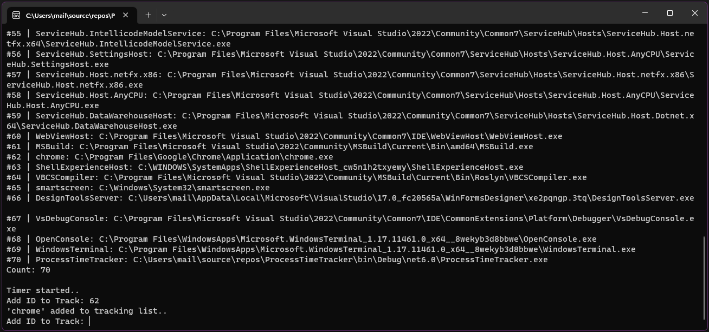
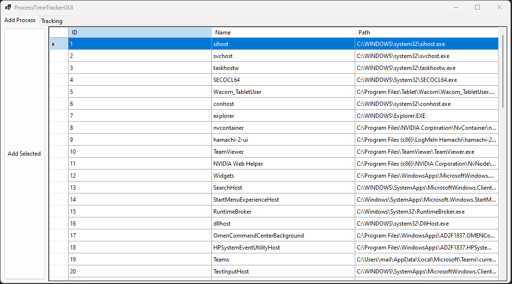
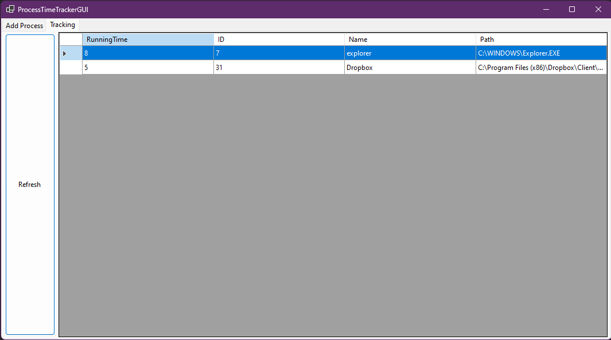

# ProcessTimeTracker

1. gets all running processes
2. you can add any process to the tracking list
3. timer is checking every second if processes on tracking list are running or not

# Console Handler

# GUI Handler

